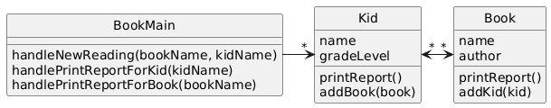
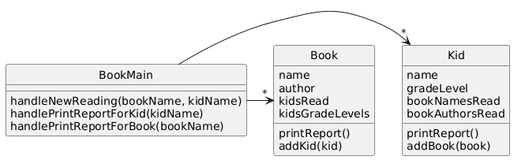

# Books

## System Description
A website tracks books and the kids that read them.  For each book the system stores the name and author.  For each kid the system stores name and grade level.  The teacher enters when a kid reads a particular book.  It should be possible to print a report on a book that includes all kids who have read a particular book (with their grade level).  It should be possible to print a report on a kid that includes the books (with authors) a particular kid has read.

## Solution A

[PlantUML link](https://www.plantuml.com/plantuml/img/VK_13e8m3BtlAnfEOFGFZ34UlAZ4y0ULDRWmDh8DZJ7ykoiGY0Uzj2-lh--rUn_GXQxHmjVAjEYm0HzUcc9rgXmcejJeFHoihU4j0C1WGzon2tVh6BLEcL1GQrr8is4avKd9j5Oo4_ra48dl_SgXf3CzIF_ouCpq5ilYmjG5bHcjxcYaffoU1Q5KfXh4UVHVGynca2sowv9mj6wwxwzcpXzLlH1p_6O7oIhXfmG_ndWxSQpv0000)

## Solution B

[PlantUML link](https://www.plantuml.com/plantuml/img/VOzD3i8W48Ntd89qrHgzWb4Nkl0dfZSOowGbfT00QepftMNwGsDYtC3mvl6-cOtpOFszKSpLKhTWeU7ElnI6qygYxx12WNDyPqpDtunphg51kk7kAsEfggLmEOAOweC5WITye78ajLPgdsDhh4-p_gSGHodIOCrOD-O7uJk-Z27qkWNy9NGYXuHjFq6KVd5ex9IyCucaCqWzu2hGGk45dvGYTPbEf2MjGaKsswupOM_ikCDVJ-GFhewnY5-jUR98QF5PcqGIFW00)