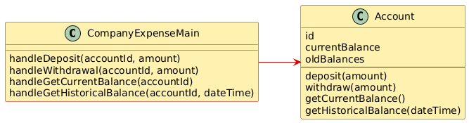

# Company Accounts

## System Description
A particular company keeps a variety of different accounts for its projects. Each account has an account number and a balance.  When a deposit or withdrawal occurs, the transaction occurs immediately, and the current balance should be updated. The system should support getting the current balance.  
The system should also support getting the balance as it existed at any date/time in the past.  Note the input historical date/time may not correspond to a particular transaction time - e.g., if the system had a balance of $1 at 1 p.m. and then was changed to $2 at 3 p.m., a request for the balance at 2 p.m. should return $1.

## Solution A

[PlantUML link](https://www.plantuml.com/plantuml/uml/VP71JiCm38RlUOfeN1ZQf8a7GDiw2XouJU9i4gyDIvtASLKGujt9kewj5D536lt-adoMbr60fQcyyhWJBK6pAqhHrZ4QSO6KYdj7DJ1KEfPWG-keq3lm4IygnaECQp3xWaD3DWi-iBxAy_nslHXXWIroZsJP8ds_aJoGz42g3e4LSsY7frLtI6UXge4-xjzhf8ZFu4X_AgrB8EjnWtM8Jgx1c6GeJtQceJhifZ_8YvFIChJW_wCUKBA66KdMu84Cdk41zEYY17O6_8YRQGk2MrVXL7sTx5V7QgViR5hCu9KKpETfiNqVPwssrxw8Yf5Zduwb_Z3PCb24RlgTpUiHNTct9ag592cJCxFfRpXSC1v1ihuxzQRwVvTDRYQNBwabacqg_mq0)

## Solution B

[PlantUML link](https://www.plantuml.com/plantuml/uml/VP31JiCm343l-OfeN1XQfOaFG5iB1GxSa3XRYTT6I-tASLKGujyfesChHUHWnVQpyfnDKX3jccWYxjGgMmbLhTO7GQU1oPYq3zI2G6DJ3PxxG9NTGKnurd4HKih1xIlXZdp1aSLUb6LvdQzd68j76P6YM0_dDr8owGWCtIcm5U5-EcqEGxRWfWLwktjjaH8-GI3xRgojWNp4Msmv1Rq4vxWZVVGh2ytNRVc3l0IjlK0FyJ_g7hNeH90qXmZay0HFe8UGb2KuY3DkPJqeFeS6b-RZQB_zxXwKWn-2cxmo53ZwCKb3bcL3yEDM9yb-NEAiLCsCn-fSSUBrntzcsOrTN2sEicQ3vBicVW80)
