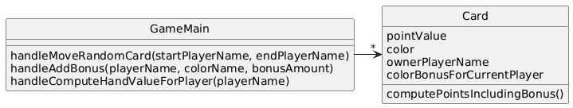
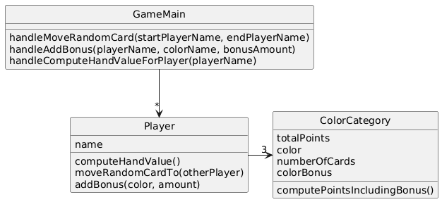

# Colored Cards

## System Description
In a particular card game, players have hands of cards.  Each card is worth some points and also has a color (red, blue, green).  During play, players accrue bonuses that mean cards of a particular color are worth bonus points.  During play, sometimes a random card is selected from one player's hand and moved to another player's hand.  At the end of game, it is necessary to compute the total points for each player's hand

## Solution A

[PlantUML link](https://www.plantuml.com/plantuml/uml/JL3BRW8n3BpdAonEB89Vg0Gh5JY0K0-zcurL8X9xvIIjKCM_amtBun9xDFRCEF7ik4V5035TF9LNNPToyCPq7cE4DGRQeMFuDoTawsadl_HLEWajgft6X9eE7Y-a-p8w1sBxWisujBHs9PpZj7-RxCJBs1u7SXaaStgij1Bwd6XJm3VwJ9-YTzqtZSO0NCUWGveI4g0Nnwck550zIfK_9dtbUZ0rL55kiohnU4Sbg_bXa8fRxdosZd_k9pJcQfw_ilY0oMnIpMy0)

## Solution B

[PlantUML link](https://www.plantuml.com/plantuml/uml/NP1DJmCX48Rl_0gofwrfJzvDwYPQ3zN66EzJ65iYC1iOJ3Qc_rtOPVlXXOzvPzxtWVXjV0y1d8myMCnhC8gJiq8e2p7APt2u1UFbhpY2rnQtz8Fl-KIkWw3Ro11uPs70y9fRbnAzlbmNTMYjzIFv5Dl-gbEHfNhS5t7jA7cUHpfoVMBSvCids8HF52RVAu-5aF8qaqvgvfJIPorlwfz5M_hT3Vy7jSH7hDP5Xnbrn5jAg5Id6jELSWUC1mh3cCR4O7TaFCSnDEk58RazXhUladAkZyuNicdenIkRjF67ART4dNzzjNgGpLrJ7oVg6qlnlhb5-GC0)
