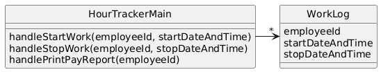

# Hour Tracker

## System Description
A system tracks employee hours at a particular company.  Every time any employee starts work and stops work, the system must log it so the employee can be paid correctly and so management knows who was working when.  The system must also print out a weekly pay report for each employee which includes total hours, the employee's name, social security number, and employee id. 

## Solution A


[PlantUML link](https://www.plantuml.com/plantuml/uml/RO_Bgi8m443tynL3LxUNUtz1AhXGK2XQS3qqWuRc4IRfeaZ_tRRuaDfDDZbpvamH4qbghO7OQ1T8o69CdU7X5LrFFr0RYX6tlfLAg6vO3gGTtk1AJXa-ZOQpb-Q7RJ2-OzwfFvoy6qgyTghIblCNxSC2xCC2MufsgQJkoC5B-fZ80R5_P8solRyCEOXl0l2h072-1tg0-LN_Ayn-iwSL2dQgjUOE)

```PlantUML
@startuml
skinparam style strictuml

class HourTrackerMain {
handleStartWork(employeeId, startDateAndTime)
handleStopWork(employeeId, stopDateAndTime)
handlePrintPayReport(employeeId)
  }
class Employee {
  employeeId
  name
  socialSecurityNum
  startDateAndTime
  stopDateAndTime
  createPayReport()
}

HourTrackerMain -> "*" Employee
@enduml
``` 

## Solution B


[PlantUML link](https://www.plantuml.com/plantuml/uml/RO_Bgi8m443tynL3LxUNUtz1AhXGK2XQS3qqWuRc4IRfeaZ_tRRuaDfDDZbpvamH4qbghO7OQ1T8o69CdU7X5LrFFr0RYX6tlfLAg6vO3gGTtk1AJXa-ZOQpb-Q7RJ2-OzwfFvoy6qgyTghIblCNxSC2xCC2MufsgQJkoC5B-fZ80R5_P8solRyCEOXl0l2h072-1tg0-LN_Ayn-iwSL2dQgjUOE)
