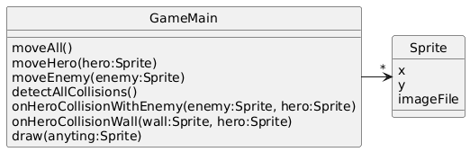

# Sprites

## System Description
In most classic 2D games, a "sprite" in an individual drawable element (e.g. the hero, one particular enemy, etc.).  The game draws numerous sprites on the screen representing the walls, bullets, enemies, etc.  The different types of sprites move differently, respond differently when the encounter the hero - but they're drawn in a similar way (e.g. placing a particular image at a particular position on the screen).

## Solution A

[PlantUML link](https://www.plantuml.com/plantuml/img/RP3B2i8m44Nt-Oh1LHJz0HU2Y8-DAnUkXtPe1_CeIRG6wR-RM5lmiJaCbtllPE8lR1fqgC67g2ZHSH6kMWbHAFGUJetZGF0G073FY1ciiQ8TAnBTODoZfYEoILPjRxHMIavVqu6SbNN2ik_grQqX7ILbZdf9WOgGaXkh57ksngSEQtB3A9qvrB_XENni-CvWUasRyDzTEcmbcXZOL8C8aExin7ZLOWMJsUJz7U89)

## Solution B

[PlantUML link](https://www.plantuml.com/plantuml/img/RP6xhi8m38RtF8N5L12y00FI4HnWOM9Wjef5hPDBbOHBXNZtuxHGqSlonx8__tQIyCUsH8y6GgmqYNhEuzLefNAD8S2nz1m9dWe07acg96pmGblMf5uVS8U63iXMK25UtVw3kv6NYf7pH-jiMaTxyYuhH9ODrMH_BPagewHjlcUtTbfpO6St52cFBbcVwr3CssAGCSwc8MtgnB4O-i-XiqI_1sNXkyWutLjju_5UN_KiGOQsYWNRouS6I7o7NAnWCfkykzNtSot6IiEhzx3s7rB-oswiC30RWvez_m40)

## Solution C

[PlantUML link](https://www.plantuml.com/plantuml/img/fP3D2i8m48JlUOhWgHLyWHu44NykdZpqlDIbNTmaaiIV8drtaxHMHV3YPTWCau_TSKVI9x2WfFCjOr1BbJyh5g9YS4xkJvOyohkGKjwYj558GOrhOXJTCxX5Qq9CcGjckQZHzp-plEY7aEo3AusgVIMDNXfcScHqIRw9cAm9KiJf9wW4vlyu0sW32dT0Ue0jc0FlW1uh7-OHww9huPg1RZtfUk3aKePAEZ5IPhDvQkFJcKmdQUDlDnKYKd_H6hRhQtepqhblxmS0)