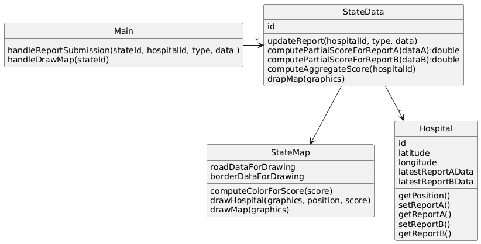

# StateHospitals

## System Description
A government agency tracks hospital data to make a monthly report.  The highlight of the report is a set of colorful maps that show every hospital in a particular state with colors indicating the hospital's overall status. To make this report, hospitals submit two different kinds of reports (reportA, reportB) that come in at different times.  Each of these reports is analyzed differently and produces a partial score.  The final map color is produced by combining these three scores into an aggregate score, using the most up-to-date version of each report available at that time.  Color on the map is positioned according the the hospital's specific latitude and longitude which is stored in the system and does not change.  The drawn map also includes the states borders and major roads.

## Solution A

[PlantUML link](https://www.plantuml.com/plantuml/img/ZLBRQiCm37ttLvW-9QFzWJ9AsvNHmih6kXzGOfEOERQHdOqo-k-JSba3AsClmaX7FXTx7HDWQXihuhjn0H0Q6TFPQgfeocuYIWinoYCOzoMahC4fgrzry9XERT6O68rt6LsKz47DPUrZC0aidzCvwBbKa43cFwixXCyZX74Z5vU1uSGDoHn6KK4FQaUhZnvvnRYAceL7fV5NUoHzWcHIgxHSoZt4ccZk3oxDTxujh5vDWTvLVoD1gTvaTjiH6ofz4zgaDrM5kYBnfzAZdk0dc0TlFPBc7XAvybIHXVs0pog4K9ioNaCS8PpNEEN0XiHwWLraB6pYxy090gBv04jfyOX5N_MyqBiRi9sSBKIjdjqRNP7bIzL5S1j91dhEpN-1solm8lWFBLPoTZVh7rjqTJ6q-WMnraxnl_i6)

## Solution B

[PlantUML link](https://www.plantuml.com/plantuml/img/VLBRRi8m37tFLqGyjLFvWJrCq26qFI2XyGMcYKAqj8aILmXD_FliadPqjvVKbsCV7zUhX12nRvr8xxOB4A6L2IzEqnjjCsH4uo0bkGFRVGWfJz0ffzzqy14F_R6rALdV5TG8zQkgvCcdO14SstW9kf8A46GvbMuYd7SGnefIN3F3WGCR1ZEFLQ8FL9gfYj_xbgBnRUXHxqc71NTeVDHR7sz5wu8nw_9H-VxeD7Nz3rqFw7f2P-pQcAWD3JAWx-OeXOeGM8gXxyasYRNSYw7Se2LwK2oCg5YzxGm5Zpug7N-4C-kpTpvIuaQQ-EKL4kFv9KymqLOo-6IHVaCbPyW_PXiRZ7kMqW5Qx1LloFdEJ3PfI9XtoPD-YzKvPZJkymG5SoSz5WskcRjJjfvdsRqAlhFbarmyBBuEGapMabBZQkTHBXY5YPNk5D_k9m00)