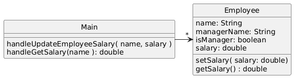

# EmployeeSalary

## System Description
There is a company which has employees, each of which has a salary. There are specific employees which oversee other employees called managers. While employees have their salaries which can be updated from time to time. Unlike employees, a manager’s salary is always 10% more than the salary of their top paid employee. 

## Solution A

[PlantUML link](https://www.plantuml.com/plantuml/img/NL0n3i8m3Dpp2giJHV213gWBOYfBnGFSnYeHYLCbwL0X_axIbWXOBFdkT7TsxGEwC1aj_4FnY0uD-31hYjEfVc54hz5xQ53nKm3SaQMcsoWnqDcCsiv4BMfqymuO3Ht0BnkKMNoXi2cI0CeAf9qwJUArUNzyad-ILD36U1xYQf1n87VzHPLlLho2pbfDo15SSxDv17Bk7vUg3PaiuQjGElDuWc9Vv5QY9fRf4sy0)
