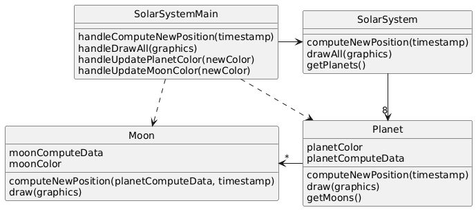

# Solar System

## System Description
A Java program draws a minute-by-minute updated diagram of the solar system including all planets and moons.  To update the moon's position, the moon's calculations must have have the updated position of the planet it is orbiting.  The diagram is colored - all planets are drawn the same color and all moons are drawn the same color.  However, it needs to be possible to reset the planet color or the moon color and the diagram should reflect that.

## Solution A

[PlantUML link](https://www.plantuml.com/plantuml/img/ZL9DQyCm3BtxLvYSqh7ilCCeZFRQKIZx0I8HhPdyWQKIokX_d-EsgqcoZukHz2IzzuJvmxW04QncEH6cDvfMZfQKQWcOzSuJnDs91Uq6ZDEVIki3k8vmvMqu2hvXl_Lin7XNYx780ZOilhlM4VfNedeV8HnCotVaFNGWk2LmA2jFFjOE-noCUpRUksd7UKPYagSIrFuXhPiHjKUvQE5weSxNrPTADXtkGeiiywn1u9-iOyh1Maauv9dEPi_bUdkxGehL7Db4qwF-ZJ_ThxnSqonrzLnTBQiif7gez4jpAus_GXeeIXFuQVdJO4A6zLy0)

