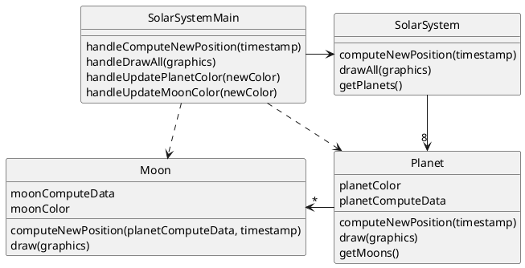

# StateHospitalsA log

## Versions 
Windsurf: 1.13.9
AI Used: Claude 3.5 Sonnet

## Chat Prompts
### Prompt 1
You are a code generator. I will give you PlantUML for a deliberately BAD design.
Rules:
- Generate minimal Java that follows the UML EXACTLY, including the SAME class names, fields, and methods.
- Do NOT improve the design. Preserve the flaws (e.g., message chains, God classes, type switches).
- Use default package (or tell me how to put into package X if I say so).
- Keep methods tiny, just enough to compile and make the flaw obvious.
- Provide one simple Main class that exercises the flaw in 5–10 lines.

Here is the PlantUML:

## Manual Edits

## Flaw Locations
### 4B
Location SolarSystemMain.java:20-26
To directly update the color of a moon you need a massive message chain
### 2C
Location Planet.java: 7 and Moon.java: 5
All moon and all planets should be the same color so items are duplicated
